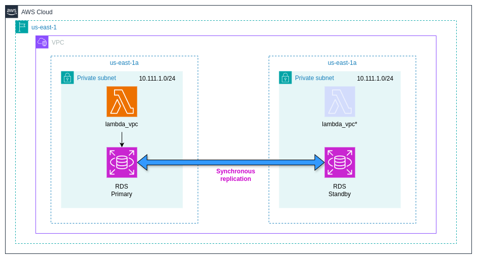
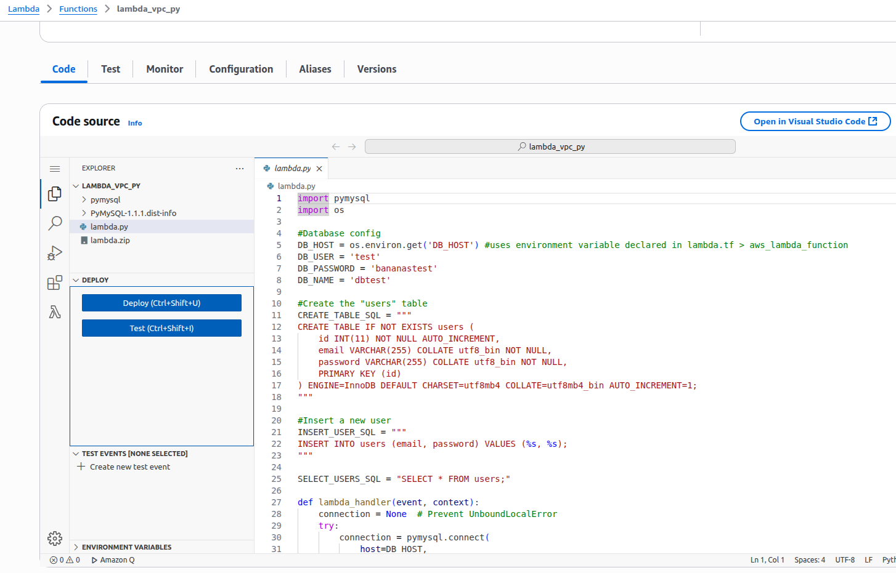
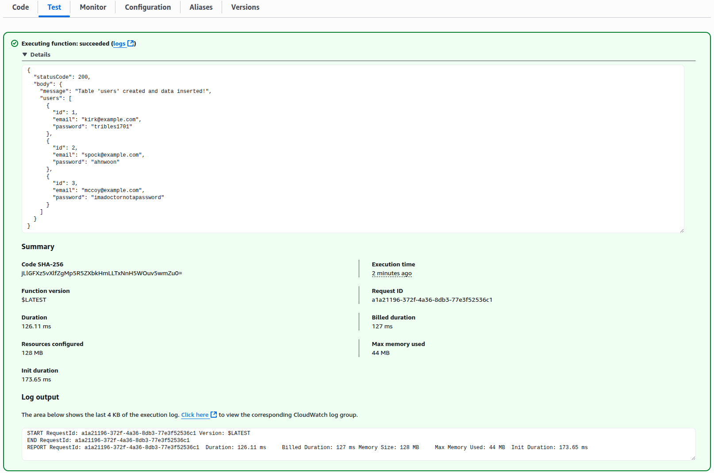

# Overview

One common requirement in a production environment is making infrastructure private, for security reasons. In this tutorial we are going to work with two services that can be either public or private, such as Lambda and RDS, and we will allow them to interact between each other. 

A private Lambda is refereed as Lambda VPC and acquires this quality by placing one ENI interface in a private subnet. A public Lambda function is highly available and therefore to keep this condition with our Lambda VPC, we need to enable it in at least two availability zones. Technically, the Lambda Function will place one ENI in either one of our AZs (we don’t have control in which one), and in the event that this AZ goes down, Lambda will place an ENI in the available subnet in our secondary AZ. You can check more about Lambda VPC [in the official documentation](https://docs.aws.amazon.com/lambda/latest/dg/configuration-vpc.html)

For a private RDS we also need two private subnets in different Availability Zones. In one AZ we will have our Primary RDS and in the secondary AZ will have our Standby RDS which will be up to date and ready to use in case of an event, thanks to the synchronous replication. 



## Set up the Providers
 
```
terraform {
  required_version = "~> 1.10.2"
  required_providers {
    aws = {
      source  = "hashicorp/aws"
      version = "5.83.1"
    }
    local = {
      source  = "hashicorp/local"
      version = "2.5.2"
    }
    tls = {
      source  = "hashicorp/tls"
      version = "4.0.6"
    }
  }
}


#Configuring AWS Provider
provider "aws" {
 region = "us-east-1"
}
```

## Create the base infrastructure

The following code will create one VPC (10.111.0.0/16) and two subnets (10.111.1.0/24 and 10.111.2.0/24) in different AZs, as discussed above, as well as their respective local routes. 

```
#VPC 
resource "aws_vpc" "main" {
  cidr_block           = "10.111.0.0/16"
  enable_dns_support   = true
  enable_dns_hostnames = true
}

#Subnet Private 
resource "aws_subnet" "private_subnet" {
  vpc_id            = aws_vpc.main.id
  cidr_block        = "10.111.1.0/24"
  availability_zone = "us-east-1a"
}
#Subnet Private B
resource "aws_subnet" "private_subnet_b" {
  vpc_id            = aws_vpc.main.id
  cidr_block        = "10.111.2.0/24"
  availability_zone = "us-east-1b"
}

#Private Route Table
resource "aws_route_table" "private_rtb" {
  vpc_id = aws_vpc.main.id
  route {
    cidr_block = "10.111.0.0/16"
    gateway_id = "local"
  }
}

#Private Route Table B
resource "aws_route_table" "private_rtb_b" {
  vpc_id = aws_vpc.main.id
  route {
    cidr_block = "10.111.0.0/16"
    gateway_id = "local"
  }
}

#Associate private Subnet to private route table
resource "aws_route_table_association" "private" {
  subnet_id      = aws_subnet.private_subnet.id
  route_table_id = aws_route_table.private_rtb.id
}
resource "aws_route_table_association" "private_rtb_b" {
  subnet_id      = aws_subnet.private_subnet_b.id
  route_table_id = aws_route_table.private_rtb_b.id
} 
```

## RDS

In order to configure a private RDS, we need are going to define two private subnets on the resource aws_db_subnet_group.rds_subnet and then we need to configure our RDS instance with basic parameters such as engine, storage, instance class, etc, and most importantly, setting publicly_accessible to false, so in order to connect to this RDS we need to be in the same VPC. 

```
#DB Subnet Group / need to associate Subnet to DB
resource "aws_db_subnet_group" "rds_subnet" {
  name       = "rds-subnet"
  subnet_ids = [aws_subnet.private_subnet.id, aws_subnet.private_subnet_b.id]
}

#DB Instance
resource "aws_db_instance" "rds" {
  db_name                = "dbtest"
  allocated_storage      = 10
  engine                 = "mysql"
  instance_class         = "db.t3.micro"
  username               = "test"
  password               = "bananastest"
  skip_final_snapshot    = true #to be able to destroy it
  vpc_security_group_ids = [aws_security_group.rds.id]
  db_subnet_group_name   = aws_db_subnet_group.rds_subnet.name #associate Subnets to instance | needs at least 2 subnets
  publicly_accessible    = false
}
```

## Lambda

If you are not familiar with Lambda Functions, I go into more depth in my tutorial [Creating a basic Lambda function in AWS with Terraform](https://github.com/victorhponcec/tutorial-aws-lambda-basic). 

We will use the AWS managed role [AWSLambdaVPCAccessExecutionRole
](https://docs.aws.amazon.com/aws-managed-policy/latest/reference/AWSLambdaVPCAccessExecutionRole.html
) which will allow our Lambda to place ENI interfaces in our VPC. 

For the Lambda Function lambda_vpc we will set two subnets which are in different AZs for the high availability purposes that we discussed before and its security group. We are also going to use the environment variable DB_HOST to pass the RDS endpoint to lambda.py

The Lambda code itself (lambda.py) will connect to our RDS, create a table and insert some Trekkie users.

```
#IAM Role/Trust Policy for Lambda
resource "aws_iam_role" "lambda" {
  name               = "hello_lambda_function"
  assume_role_policy = <<EOF
{
 "Version": "2012-10-17",
 "Statement": [
   {
     "Action": "sts:AssumeRole",
     "Principal": {
       "Service": "lambda.amazonaws.com"
     },
     "Effect": "Allow",
     "Sid": ""
   }
 ]
}
EOF
}

#IAM Policy For Lambda
resource "aws_iam_policy" "lambda" {
  name        = "policy_for_lambda"
  path        = "/"
  description = "IAM Policy for the Lamnda Role"
  policy      = <<EOF
{
 "Version": "2012-10-17",
 "Statement": [
   {
     "Action": [
       "logs:CreateLogGroup",
       "logs:CreateLogStream",
       "logs:PutLogEvents"
     ],
     "Resource": "arn:aws:logs:*:*:*",
     "Effect": "Allow"
   }
 ]
}
EOF
}

#Policy Attachment 
resource "aws_iam_role_policy_attachment" "attach_role_policy_lambda" {
  role       = aws_iam_role.lambda.name
  policy_arn = aws_iam_policy.lambda.arn
}
#Policy to allow lambda to create interfaces in VPC 
resource "aws_iam_role_policy_attachment" "attach_role_policy_lambda_vpc" {
  role       = aws_iam_role.lambda.name
  policy_arn = "arn:aws:iam::aws:policy/service-role/AWSLambdaVPCAccessExecutionRole" #https://docs.aws.amazon.com/aws-managed-policy/latest/reference/AWSLambdaVPCAccessExecutionRole.html
}

#ZIP code for Lambda
data "archive_file" "zip_py" {
  type        = "zip"
  source_dir  = "${path.module}/lambda_code/"
  output_path = "${path.module}/lambda_code/lambda.zip"
}

#Lambda Function
resource "aws_lambda_function" "lambda_vpc" {
  filename      = "${path.module}/lambda_code/lambda.zip"
  function_name = "lambda_vpc_py"
  role          = aws_iam_role.lambda.arn
  handler       = "lambda.lambda_handler" #lambda=name of the file | lambda_handler=function to invoke the python code
  runtime       = "python3.8"
  depends_on    = [aws_iam_role_policy_attachment.attach_role_policy_lambda, aws_iam_role_policy_attachment.attach_role_policy_lambda_vpc]
  vpc_config {
    subnet_ids         = [aws_subnet.private_subnet.id, aws_subnet.private_subnet_b.id]
    security_group_ids = [aws_security_group.lambda.id]
  }
  environment {
    variables = {
      DB_HOST = aws_db_instance.rds.address #env variable: passes the RDS endpoint to lambda.py
    }
  }
}
```

## Security Groups

For our last step, we need two security groups, one for the RDS and another for our Lambda Function. The RDS’s security group will have two ingress rules, allowing all traffic coming from within the VPC (in case you want to add more resources like an EC2 instance that would need to connect to our RDS) and another ingress rule to allow the Lambda itself, as well as a default egress rule. 

The Lambda’s SG only needs an egress rule. For security reasons it’s better not to configure an ingress rule.

```
#Security group RDS
resource "aws_security_group" "rds" {
  name        = "rds"
  description = "allow VPC and Lambda"
  vpc_id      = aws_vpc.main.id
}

#Ingress rule for VPC
resource "aws_vpc_security_group_ingress_rule" "allow_rds_vpc" {
  security_group_id = aws_security_group.rds.id
  cidr_ipv4         = "10.111.0.0/16" #VPC CIDR "10.111.0.0/16" or SG of EC2 
  from_port         = 3306
  to_port           = 3306
  ip_protocol       = "tcp"
}
#Ingress rule for Lambda
resource "aws_vpc_security_group_ingress_rule" "allow_lambda" {
  security_group_id = aws_security_group.rds.id
  referenced_security_group_id = aws_security_group.lambda.id
  from_port                    = 3306
  to_port                      = 3306
  ip_protocol                  = "tcp"
}
#Egress rule
resource "aws_vpc_security_group_egress_rule" "egress_rds" {
  security_group_id = aws_security_group.rds.id
  cidr_ipv4         = "0.0.0.0/0"
  ip_protocol       = "-1"
}

#Security group Lambda
resource "aws_security_group" "lambda" {
  name        = "lambda"
  description = "allow egress"
  vpc_id      = aws_vpc.main.id
}

#Egress rule
resource "aws_vpc_security_group_egress_rule" "egress_lambda" {
  security_group_id = aws_security_group.lambda.id
  cidr_ipv4         = "0.0.0.0/0"
  ip_protocol       = "-1"
}
```
## Apply the Changes

On our local console we need to initialize our project, plan and apply. (notice that creating the RDS instance can take quite some time)

```
terraform init
terraform plan
terraform apply
```

## Testing

Now that everything is in place, we can verify our Lambda function in the AWS Management Console by navigating to Lambda > Functions > lambda_vpc_py



On the same screen, go to the "Test" tab and click "Test", this will start our lambda and insert our trekkies (data) into the DB. 



The successful execution of our Lambda Function concludes this lab. 